<p align='right'>
    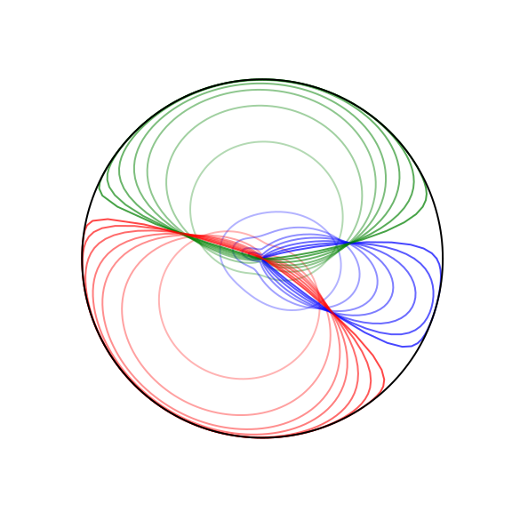
	<h1>
    	Deep Feature Space:<br>
	A Geometrical Perspective
	</h1>
	<br>
</p>


<h5> In this repository you can find:</h5>

* A library for executing operations in higher dimensions with *Clifford Algebra* and *Python*,
* A simple GUI for calculating the Softmax graph under scaling and rotation of the input feature vector,
* A brief demonstration of the results regarding the feature vectors' distribution and its main properties.
<br>
<i>The presented work includes a part of the implementation from our paper entitled:</i>
@misc{
title        = {Deep Feature Space: A Geometrical Perspective}
author       = {Ioannis Kansizoglou, Loukas Bampis, and Antonios Gasteratos},
}
<br>


<h5>Feature Space division by three target classes in 3-D</h5><br>
<table>
    <tr align='center'>
        <td align='center'>
            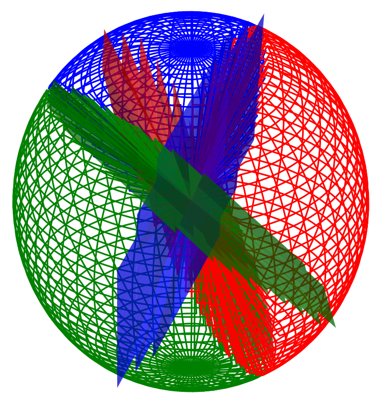
        </td>
        <td align='center'>
            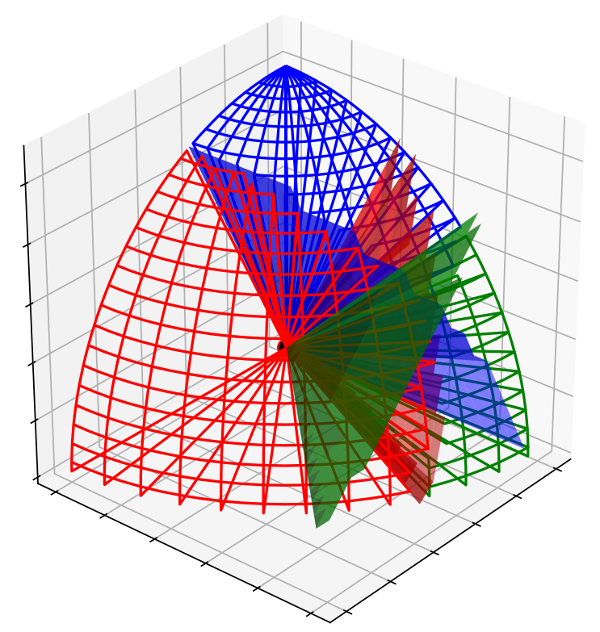
        </td>
    </tr>
    <tr align='center'>
        <td align='center'>
            3-D Space Division (<i>Linear</i> Activation)
        </td>
        <td align='center'>
            3-D Space Division (<i>ReLU</i> Activation)
        </td>
    </tr>
</table><br>


<h4>Clifford Library</h4>


<p align='center'>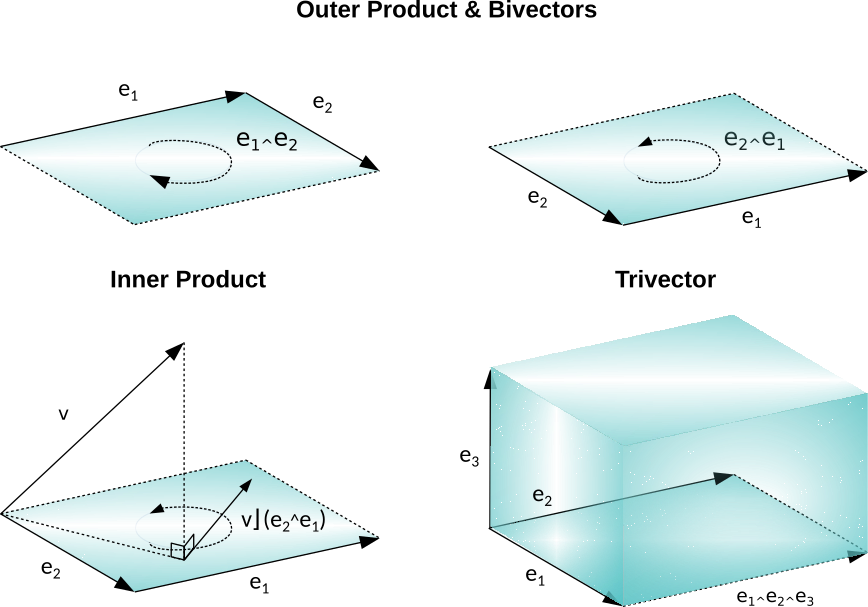</p>


```python
>>> import numpy as np
>>> import CliffordNumbers as cn
```


We define a 3-D Clifford Space as follows:

```python
>>> cl3 = cn.Cl(3)
```

with  its 1-D basis *vectors*,  its 2-D basis *bivectors*, and  its 3-D basis *trivector*.

Consequently, any 1-blade *vector* *v* of this space is described as a linear combination of the above basis 1-D basis elements.

```python
>>> v = cn.ClVector(cl3,[1,2,3])
>>> v.coordinates
# Out[1]: {'e1': 1.0, 'e2': 2.0, 'e3': 3.0}
```


The same applies for any 2-blade *bivector* *B*, which is composed by a linear combination of the basis bivectors.

```python
>>> v = cn.ClVector(cl3,[1,2,3])
>>> v.coordinates
# Out[2]: {'e1': 1.0, 'e2': 2.0, 'e3': 3.0}
```


<p>
Any <i>multivector</i>, which is comprised of a linear combination of different <i>k</i>-blades, is denoted as:    
</p>

```python
>>> v = cn.ClNumber(cl3,{'e1': 1, 'e2': 0, 'e3': -1})
>>> v.coordinates
# Out[3]: {'e1': 1, 'e3': -1}
```


<ul>
<i>Scalar Multiplication, s * <b>v</b></i>     
</ul>


```python
>>> (2*v).coordinates
# Out[4]: {'e1': 2.0, 'e2': 4.0, 'e3': 6.0}
```


<ul>
<i>Geometric Product, <b>v</b> * <b>w</b></i>     
</ul>

```python
>>> w = cn.ClVector(cl3,[0,1,0])
>>> w.coordinates
# Out[5]: {'e2': 1.0}
```

```python
>>> (v*w).coordinates
# Out[6]: {'e1e2': 1.0, '': 2.0, 'e2e3': -3.0}
```


<ul>
<i>Outer (wedge) Product, <b>v</b> ^ <b>w</b></i>     
</ul>

```python
>>> (v^w).coordinates
# Out[7]: {'e1e2': 1.0, 'e2e3': -3.0}
```


<ul>
<i>Inner  Product, <b>v</b> ** <b>w</b></i>     
</ul>

```python
>>> (v**w).coordinates
# Out[8]: {'': 2.0}
```


<ul>
<i>Definition: <b>v</b> * <b>w</b></i> = <b>v**w</b></i> + <b>v^w</b></i>     
</ul>

```python
>>> (v**w+(v^w)).coordinates
# Out[9]: {'': 2.0, 'e1e2': 1.0, 'e2e3': -3.0}
```


<h4>DeepFeaturesGUI</h4>

<div align='center'>
    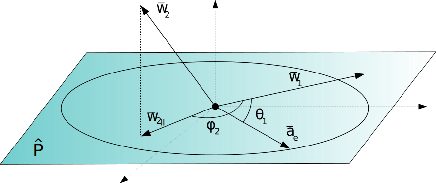
</div>


We introduce a simple application to calculate the diagram of the Softmax Function over the feature vectors' norm *R* and orientation . This is the angle of the feature vector  with the weight vector  of the target class *i*. The rest of the classes' weights are projected onto the unit plane  defined by the feature vector and the weight of the dominant class. 

<div align='center'>
    	<br>
	
	<br>
</div>


<br>Below, a random 13-D Feature Space is created for a 5-class classification task.


<div align='center'>
    <br>
    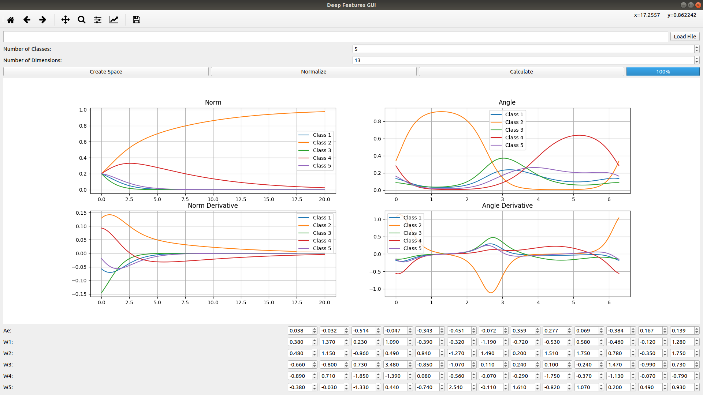
    <br>
</div>


The 1<sup>st</sup> row demonstrates the diagram of the softmax outputs under *R* and  variations, while their corresponding partial deliverables are calculated and illustrated in row 2. A more simplistic example is illustrated below with 3 target classes in a 20-D Feature Space.<br>


<div align='center'>
    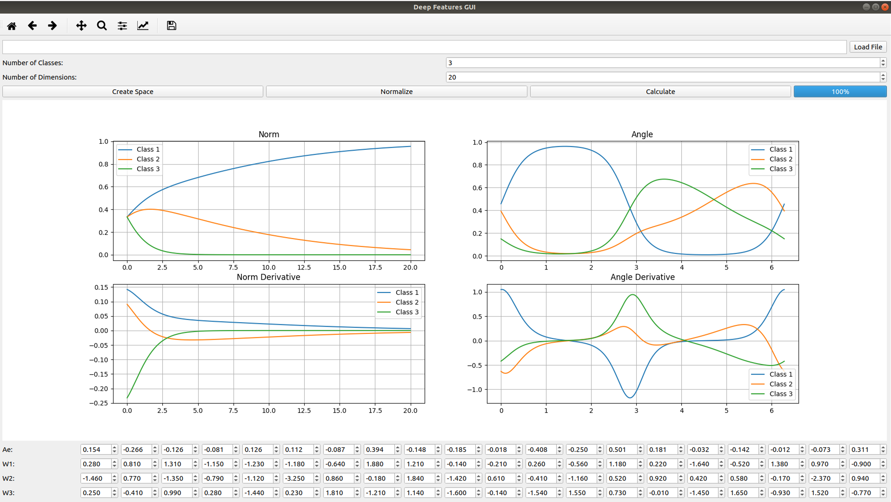
    <br>
</div>


The values of the feature vector and the classes weights can also be loaded from a local file.<br>


<br><h4>Distribution Results</h4><br>


<table>
    <tr align='center'>
        <td align='center'>
            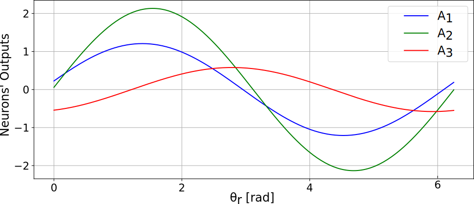
        </td>
        <td align='center'>
            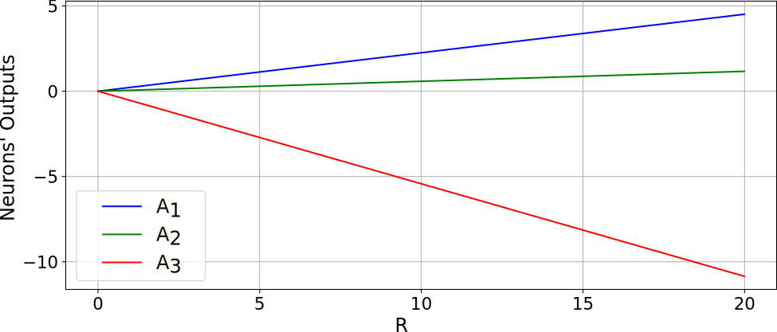
        </td>
        <td align='center'>
            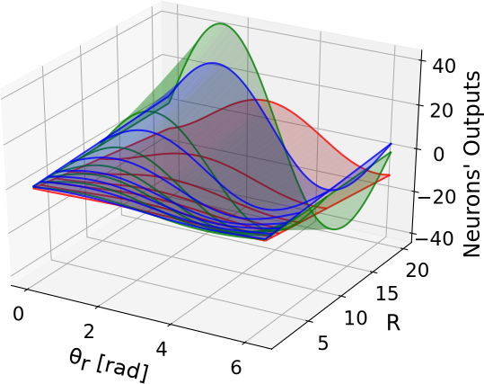
        </td>
    </tr>
</table>
The Output's Neurons diagram over feature vector rotation and scaling, as well as a multi-variable function.<br><br>


<table>
    <tr align='center'>
        <td align='center'>
            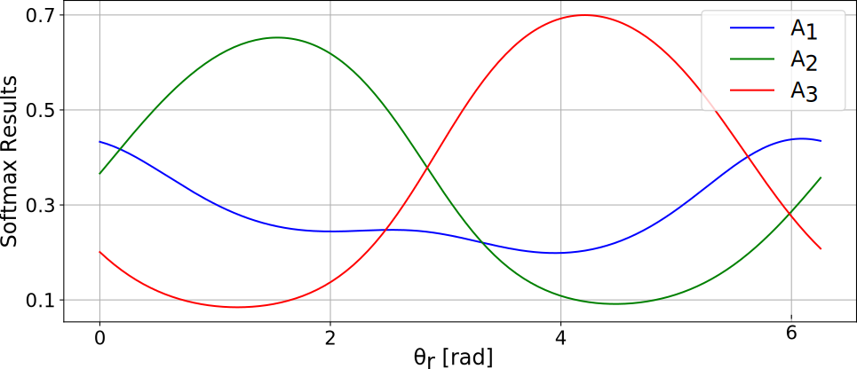
        </td>
        <td align='center'>
            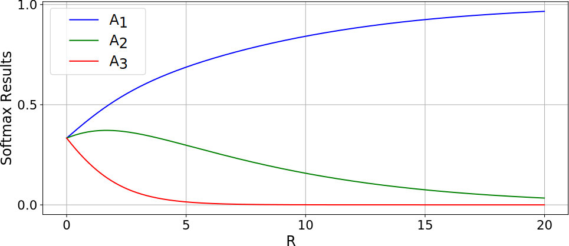
        </td>
        <td align='center'>
            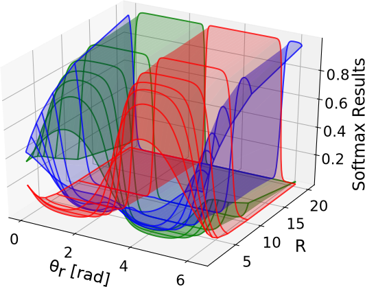
        </td>
    </tr>
</table>
The Softmax Function diagram over feature vector rotation and scaling, as well as a multi-variable function.<br><br>


The last multi-variable diagram of the softmax function can be represented on a polar coordinate system as illustrated below.

<div align='center'>
    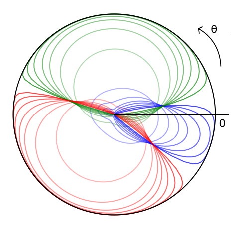
    <br>
</div>

The higher the <i>R</i> the more the softmax output of the corresponding dominant class (for each rotation angle) approximates the unit circle. 
